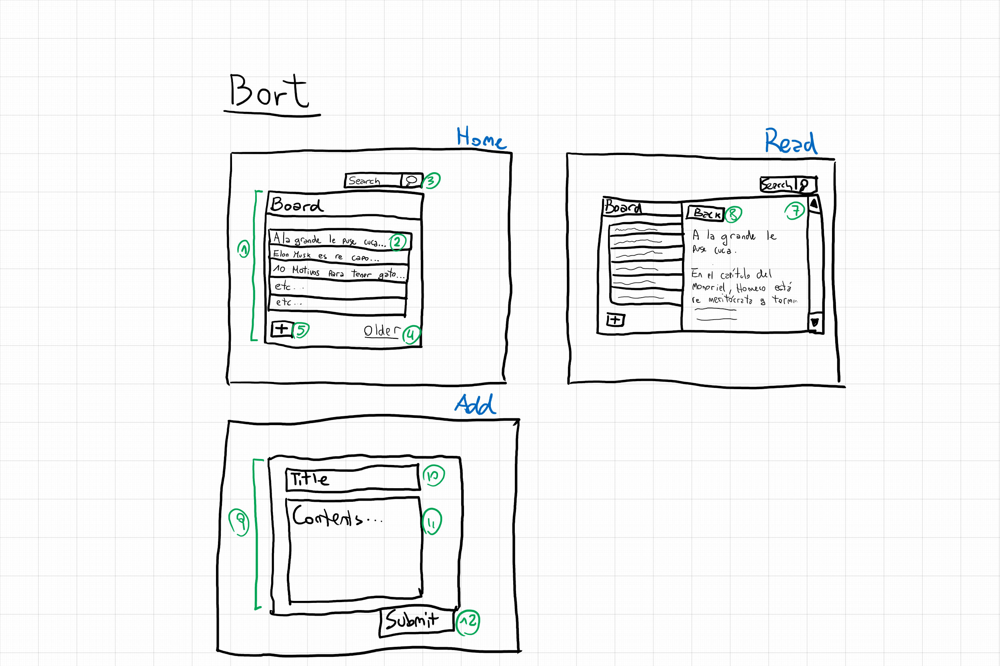
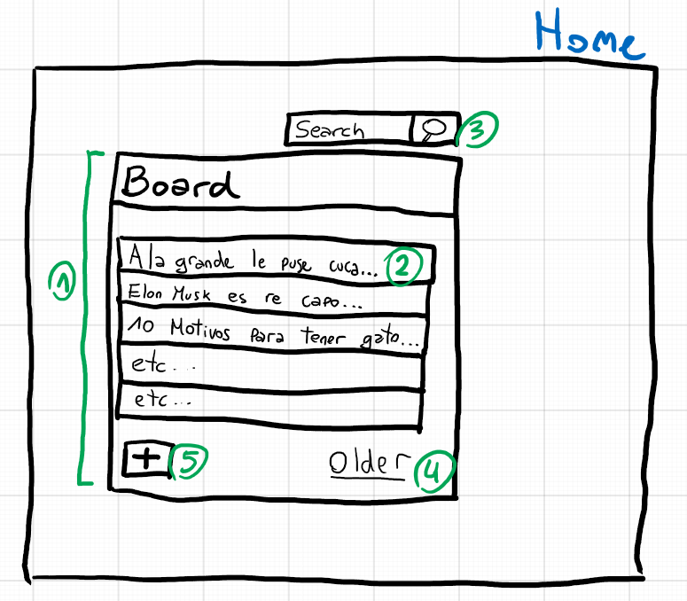
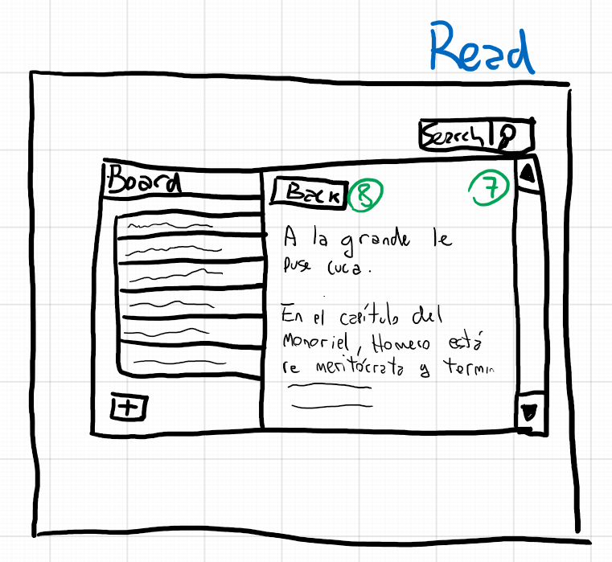
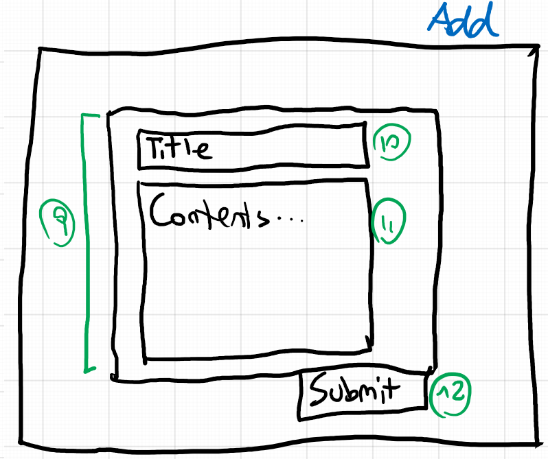

# BORT Spec
v-1.0.0

## Intro
Es una micro red social que permite publicar “anuncios” o “novedades” o “mini blogs” de sus usuarios para ser compartidos. Cómo está pensada para ser utilizada en entornos pequeños (grupo de trabajo, o de amigos, o del club de barrio), todos los usuarios verán todo el contenido y no hay concepto de “seguidores”. Todo el mundo tiene el mismo feed.

Para el desarrollo, se pueden seguir 2 caminos que tienen elementos en común y otros muy distintos:

- Con MVC (Model View Controller):
Con esta arquitectura, el sistema funcionará como una Web “clásica” donde la mayoría de la lógica de front-end se ejecuta del lado del servidor. Es decir, que el server nos va a entregar HTML/CSS/JS ya renderizado y no haremos demasiada manipulación del DOM a través de Javascript. Este es el caso para los que quieran trabajar en una tecnología típica de las intranets y los entornos empresariales.

- Con SPA (Single Page Application):
Aquí, sugiero el framework Vue JS, pero se puede utilizar React, Angular o Svelte (que los conozco menos). En este caso, vamos a delegar al servidor las operaciones de datos pero no el renderizado de HTML. Es decir, que el front-end se construye 100% con manipulaciones del DOM en Javascript, pero utilizando un framework de programación reactiva como los mencionados arriba. Este es el caso para las aplicaciones/sitios que son públicos y están pensados para uso masivo.

Con cualquiera de los dos puedo hacer una app empresarial o popular, utilizar una u otra tecnología tiene que ver más con lo que sucede en la industria y no tanto porque se presente alguna restricción técnica que impida usar una u otra para un caso específico.\
También se pueden hacer soluciones híbridas que incorporen elementos de las dos.\
En cualquier caso utilizaremos una base de datos MySQL. Para el server, la propuesta es utilizar ASPNET con C#.\
Si alguien quiere trabajar en Python en vez de C# puede hacerlo. También podemos utilizar Node Js. Pero tengan en cuenta que en esos otros casos limitan mi posibilidad de asistirlos.

## Consideraciones de diseño web
La especificación está planteada a través de “maquetas” que no definen estándares de diseño. Quizás la primera parte del desarrollo se trate de llevar estas maquetas a HTML y CSS, utilizando contenido estático para poder demostrar ese diseño que luego vamos a dinamizar. Esto es así sin importar si vamos a luego implementar MVC o SPA.

Cada uno debe hacer uso de su creatividad para definir el estilo de la aplicación (colores, fuentes, paddings, decoraciones varias, etc). El nivel de diseño al que quieran llegar depende de cuanto les interese el trabajo sobre UI.

Sin embargo, es importante tener en cuenta que se puede ahorrar muchísimo trabajo en esta parte utilizando algún paquete de componentes prediseñados que evitan tener que gastar mucho tiempo en crearlos. Como consecuencia, terminamos con diseños que se parecen todo lo que hay en la web y posiblemente carezcan de estilo propio. Siempre se puede utilizar uno de estos paquetes y customizar arriba de eso.

Algunos de los paquetes de UI más utilizados:
- Bootstrap: [https://getbootstrap.com/](https://getbootstrap.com/)
- Material: [https://materializecss.com/](https://materializecss.com/)
- UI Kit: [https://getuikit.com/](https://getuikit.com/)
- Semantic UI: [https://semantic-ui.com/](https://semantic-ui.com/)
- Bulma: [https://bulma.io/](https://bulma.io/)
- Foundation: [https://get.foundation/](https://get.foundation/)

## Especificación

Se proponen unas funcionalidades básicas que pueden ser expandidas para incluir detalles que uno quiera implementar. Vamos a definir algunos elementos básicos y luego mencionar aquellas cosas que podrían agregarse o no, de acuerdo a que features quieran ofrecer.

### Usuarios & Identidad

BORT puede ser desarrollado sin el concepto de usuarios. Es decir, que quien sea que entra a nuestro sitio puede leer anuncios y escribir nuevos. El problema es que no podríamos atribuir las entradas a personas en particular.
Sin embargo, hay muchas funcionalidades alternativas que sólo son posibles si existe el concepto de usuarios registrados. 
Por ejemplo:
- Ver qué usuario ha publicado tal o cual anuncio. 
- Posibilidad de editar un a anuncio (sólo si soy el autor del mismo).
- Restringir el acceso a la red para usuarios registrados.
- Incorporar concepto de usuario moderador (super-usuario) que tenga la potestad de elminar contenido inapropiado.
- Y montones de cosas mas.

Todo esto requiere la implementación de página de registro y log in, que no se detallan en las maquetas porque cada uno puede las puede diseñar como quiera.
Ustedes pueden comenzar con el desarrollo SIN concepto de usuarios o bien, plantear desde el vamos que necesitamos esa funcionalidad antes de seguir con el resto.

NOTA: Si eventualmente publicamos nuestro producto online, vale la pena que exista una manera de utilizar el sitio sin logearse y sin registrarse ya que algunos de ustedes podrían querer utilizar esto como portafolio/vidriera y demostrar las funcionalidades a otros (que si tienen que registrarse quizás les de pereza).

## User Interface / User Experience

### Vista: Home 

La Home presenta la lista de anuncios que hay actualmente en el sistema.
1.	Listado de anuncios realizados, mostrando en cada renglón, un preview del título del contenido
Ordenados por fecha decreciente
2.	Preview del anuncio, si cliqueamos vamos al contenido para ese anuncio, en la vista Read
3.	Campo de búsqueda. Haremos una búsqueda de contenido para filtrar el contenido del listado.
Luego de buscar podremos tener algunos resultados o ningún resultado. En todos los casos debe haber una manera de volver hacia atrás, limpiando la búsqueda y volver a ver el contenido inicial.
Opcional: Puede haber un botón “Search” o bien buscar a medida que el usuario ingresa teclas.
4.	El tablero mostrará los primeros N anuncios, por lo tanto, podemos seguir viendo que hay mas allá presionando el botón Older que cargará los siguientes anuncios, siempre en órden de fecha decreciente.
5.	Es el botón para ingresar un nuevo anuncio. Nos lleva a la pantalla “Add”.

### Vista: Read 

En el ejemplo del sketch, al cliquear un elemento/anuncio de la Home, aparece una pantalla para ver el contenido del mismo. Notar que en el caso ejemplificado, esta nueva pantalla se posiciona junto a el tablero de la Home y permanece visible para que el usuario pueda continuar cliqueando artículos sin cerrar la vista Read. Básicamente, para hacer “zapping” de anuncios.
  
Sin embargo, esta parte se puede diseñar de otra manera de acuerdo a las preferencias que tengan y además hay que tener en cuenta que una interfaz como esta, es un poco mas natural en el caso de que estemos trabajando en SPA (y no en MVC) ya que se da la sensación de que lo que estamos usando es una aplicación, y no tanto una página web.
Una alternativa es que la navegación te conduzca a la página de Read, abandonando la Home, como lo hacen por ejemplo aquí [https://news.ycombinator.com](https://news.ycombinator.com/).
  

7. Es la pantalla que muestra el contenido del anuncio/artículo.
8. Un botón Back nos lleva de regreso a la Home.

### Vista: Add

9. Vemos la vista ADD al cliquear el botón "+". Se nos presenta un formulario de entrada de un anuncio con un Título y Contenido.
Al enviarse, grabaremos la información en la base de datos y podremos ver los resultados en la Home. Quienes quieran, pueden introducir el concepto de moderación, de manera que un contenido enviado por un usuario pueda/deba ser aprobado por otros usuarios en calidad de moderadores (requiere lógica y UI para tal funcionalidad).
10. Campo de texto "Title"
11. Campo de texto multilínea para escribir el contenido. NOTA: Si el contenido es texto plano, entonces el resultado será algo así como lo que sucede en Twitter (texto simple) y no podremos contar con formato (párrafos, estilo de texto, colores, etc). Si queremos dar esa función, podemos buscar un componente editor [WYSYWYG](https://es.wikipedia.org/wiki/WYSIWYG) que permita al usuario entrar contenido HTML (guarda que es propenso a vulnerabilidades). También se puede utilizar [Markdown](https://es.wikipedia.org/wiki/Markdown) que viene a ser muy práctico y no debería ser complejo de procesar (este documento está hecho con Markdown).
12. El botón submit envía el contenido si no hubieron errores de validación (campos en blanco, etc). Si se procesa con éxito, mostraremos una vista confirmado con una carita feliz.

